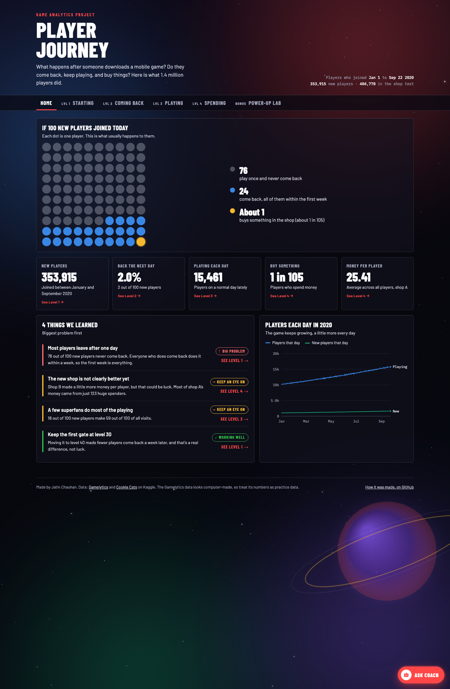
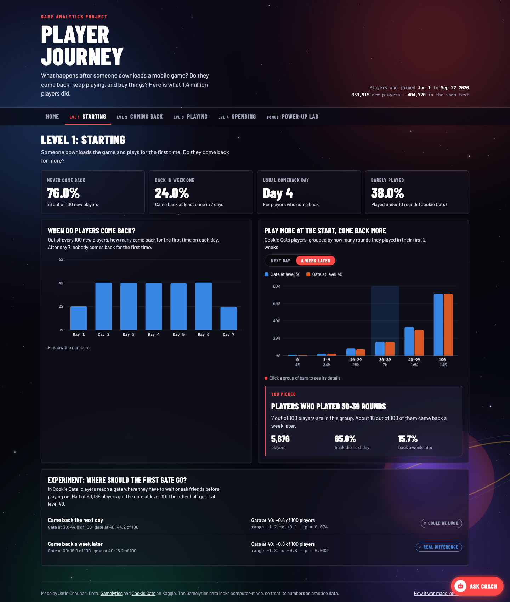
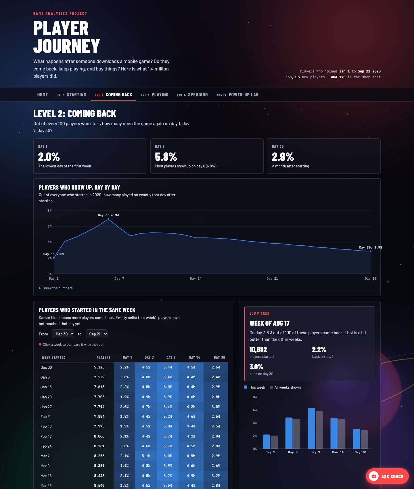
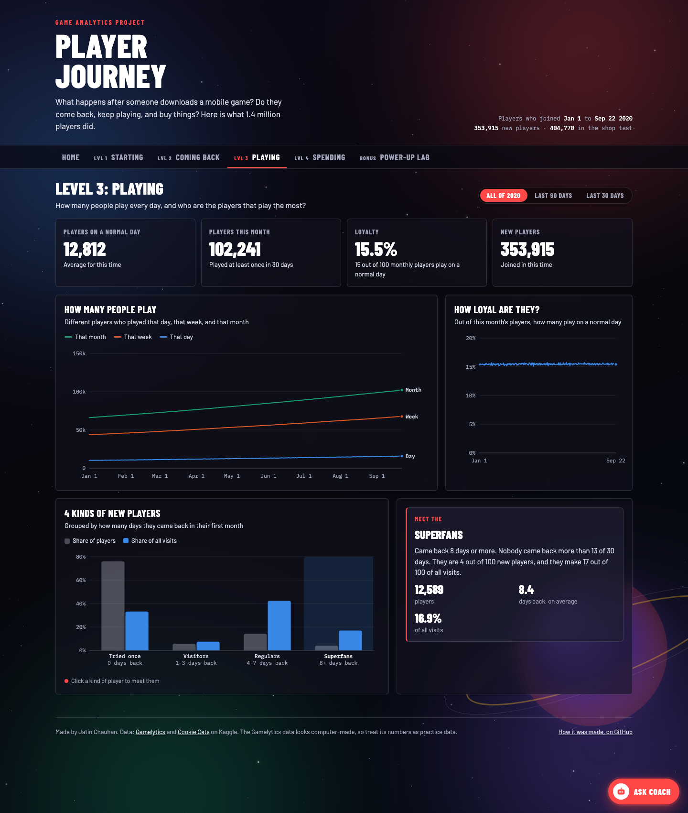
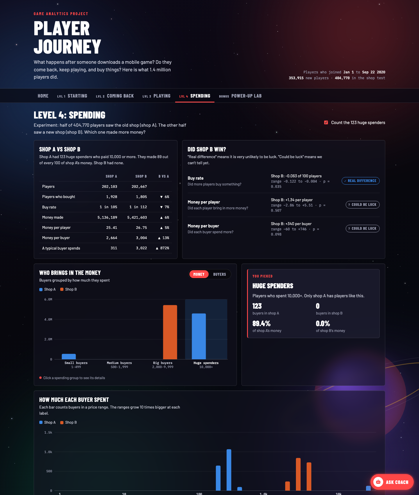
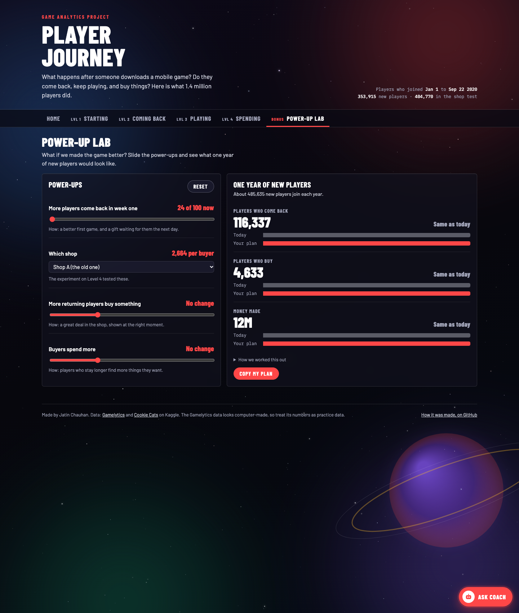
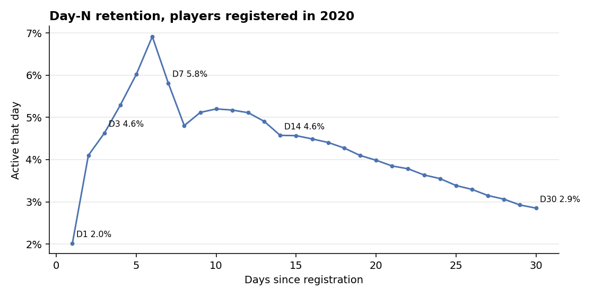
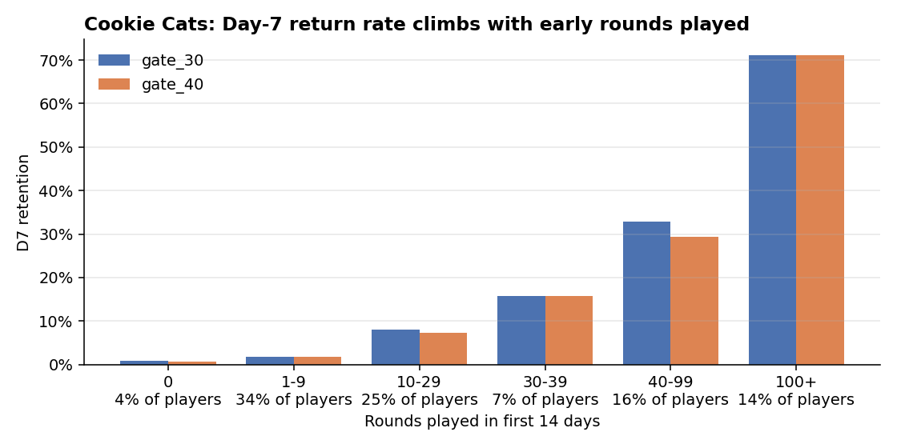
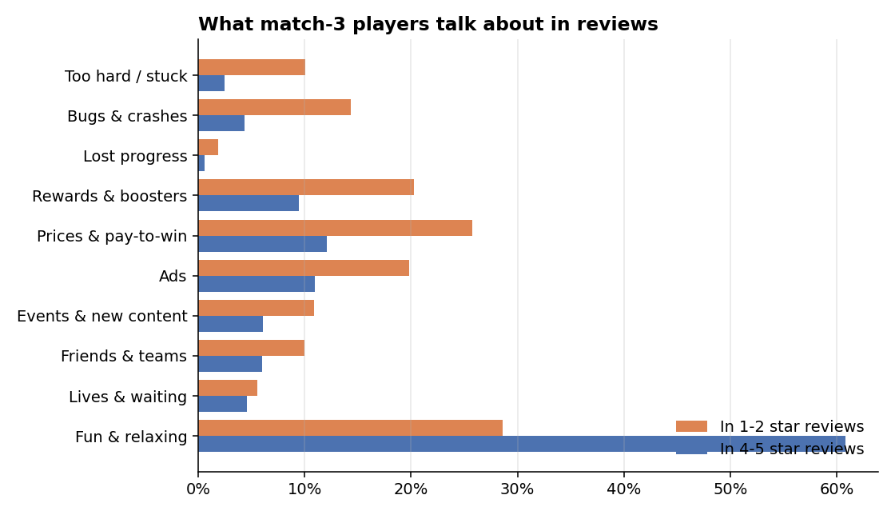

# Game Analytics: from player data to product decisions

**Live dashboard:** https://chauhan-03.github.io/game-analytics/ · **Code:** https://github.com/chauhan-03/game-analytics

A game product analytics project covering the whole loop:
- **Telemetry:** 1.4M players across onboarding, retention, engagement and monetization.
- **What players say:** 25,719 app-store reviews mined for pain points and delights.
- **The market:** a competitor review of progression and social systems.
- **The output:** features, experiments, campaigns and a go-to-market plan, each backed by those numbers.

| Deliverable | Where |
|---|---|
| Findings, with significance tests | [outputs/findings.md](outputs/findings.md) |
| Product recommendations | [RECOMMENDATIONS.md](RECOMMENDATIONS.md) |
| Product documents: funnel review, feature spec, campaign brief, competitive review, personas and survey, go-to-market | [product/](product/README.md) |
| Interactive web dashboard with a what-if planner, an API-powered helper and a mini-game | `docs/index.html` ([details](#live-dashboard)) |
| Power BI Project: model, 37 DAX measures, 6 report pages; one-command publish to Power BI online | [powerbi/](powerbi/README.md) |
| SQL for every headline KPI | [sql/](sql/) |
| 530 automated tests, including a 143-case data regression suite | [tests/](#tests) |

---

## Screenshots

| Home | Level 1: Starting |
|---|---|
|  |  |
| **Level 2: Coming back** | **Level 3: Playing** |
|  |  |
| **Level 4: Spending** | **Power-up lab** |
|  |  |

---

## What the data says

| Area | Headline | Number |
|---|---|---|
| Onboarding | New players who never come back after day one | **76.0%** |
| Onboarding | Players who return at all, and do it within 7 days | **100%** of returners |
| Onboarding | Day-1 returners with under 10 early rounds who are gone by day 7 | **96%** (vs 29% for 100+ rounds) |
| Onboarding | Moving the first gate from level 30 to 40, effect on D7 retention | **-0.8 pts** (p = 0.002) |
| Retention | D1 / D7 / D30, players registered in 2020 | **2.0% / 5.8% / 2.9%** |
| Engagement | Share of visits from the 18% of new players who return 4+ days | **59%** |
| Monetization | ARPU, offer set B vs A | **+1.34, could be luck** (CI -2.86 to +5.51) |
| Monetization | Share of offer A's revenue from 123 players paying 10,000+ | **89%** |
| Player voice | How much more often "too hard / stuck" appears in 1–2★ than in 4–5★ reviews | **4.1×** |
| Player voice | Competitors whose #1 complaint is ads | **3 of 9** |





More charts in [outputs/charts](outputs/charts).

---

## How this project maps to a game product role

| The role asks for | Evidence in this repo |
|---|---|
| Analyze telemetry across onboarding, progression, retention, engagement, conversion, monetization | `src/metrics.py`, [findings](outputs/findings.md), dashboard Levels 1–4 |
| Identify drop-offs, friction points, underserved needs | [Onboarding funnel review](product/01-onboarding-funnel-review.md): 76% day-one drop, early-rounds churn, gate friction |
| Player personas from qualitative data (reviews, community, support, surveys) | `src/reviews.py` (25,719 reviews), [personas + survey plan](product/05-player-personas-and-survey.md) |
| Competitor research and trends, propose features | [Competitive review](product/04-competitive-review.md): Royal Match, Candy Crush, Monopoly GO, Match Masters; 5 proposals |
| Define features, events, progression, social, monetization | [First Week Journey spec](product/02-feature-spec-first-week-journey.md); co-op event and race proposals; offer-set B' |
| A feature from discovery through evaluation | Spec covers problem, hypothesis, requirements, telemetry, sample-sized experiment, rollout, sprints, retro |
| Support A/B tests across messages, creatives, channels, offers, segments | Offer and gate tests analyzed (`src/stats.py`); test plans in the spec and brief; `src/experiment.py` sizes them |
| Player communication journeys and campaign briefs | [Welcome Week brief](product/03-campaign-brief-welcome-week.md): audience, insight, message, channels, metrics |
| Social, creator, app-store and community ideas | Brief §6 and the [GTM plan](product/06-go-to-market-new-game.md) |
| Go-to-market strategy for a new game | [GTM plan](product/06-go-to-market-new-game.md): positioning, soft-launch gates, launch beats |
| Track feature scope, progress and utilization | [Feature tracker](product/feature_tracker.csv) (Sheets/Excel); utilization events in spec §6 |
| Product documentation that helps teams decide | Everything in [product/](product/README.md) is written for cross-functional readers |
| SQL, Excel/Sheets, Power BI | [sql/](sql/) (checked against Python), [powerbi/](powerbi/README.md), CSV exports |
| Attention to detail | 530 tests, including a regression baseline of 141 values and checks that the doc numbers match the data |

---

## Live dashboard

`docs/index.html` is one self-contained page, written so anyone can follow it. It follows
the player's journey as game levels:
- **Home:** what happens to 100 new players, drawn as 100 dots.
- **Levels:** Starting, Coming back, Playing, Spending.
- **Power-up lab:** a what-if planner. Slide changes such as "more players return in week
  one" or a different shop, and see a year of players, buyers and money.

What you can do on it:
- **Click** any bar or cohort row for that item's details.
- **Filter** by period or cohort weeks.
- **Toggle** the 123 huge spenders on and off.

**Coach** (the "Ask Coach" button) answers plain questions about the data. It runs in two modes:
- **Default:** built-in answers, so it works on GitHub Pages with no setup.
- **API-powered:** deploy the small proxy in [coach-proxy/](coach-proxy/README.md), which keeps
  your API key as a Cloudflare secret, never in the page. Then build with
  `COACH_API_URL=https://<your-worker>.workers.dev python src/run_analysis.py`.

Bored? Coach opens **Neon Dash**, a lane-dodging racing mini-game.

**Publish:** in the repo's Settings > Pages, select branch `main` and folder `/docs`.

---

## Data

Three public Kaggle datasets, downloaded at pinned versions by `src/download_data.py`.
No Kaggle account is needed.

| Dataset | Rows | Used for |
|---|---|---|
| [Gamelytics](https://www.kaggle.com/datasets/debs2x/gamelytics-mobile-analytics-challenge) | 1M registrations, 9.6M logins, 404,770-player offer test | Retention, engagement, monetization |
| [Cookie Cats](https://www.kaggle.com/datasets/mursideyarkin/mobile-games-ab-testing-cookie-cats) | 90,189 new players | Early progression; gate-placement A/B test |
| [Play Market 2025](https://www.kaggle.com/datasets/dmytrobuhai/play-market-2025-1m-reviews-500-titles) | 25,719 reviews of 9 match-3 games | Player voice; competitor weaknesses |

**Caveat:** the Gamelytics data looks simulated, not exported from a live game:
- registrations grow smoothly and exponentially from 1998;
- no player logs in more than once a day;
- every cohort has the same retention curve;
- each offer group has exactly 1,805 ordinary payers.

The methods transfer unchanged to real data, and the docs flag where a pattern may be an
artifact. Cookie Cats and the reviews come from real games.

## Metric definitions

| Metric | Definition |
|---|---|
| Day-N retention | Share of players active on exactly calendar day N after registering (day 0 = registration). Only players who have had N full days count. With 24-hour windows instead, D1 = 4.0%. |
| Cohort retention | The same per weekly cohort. A cell stays empty until the whole cohort has reached day N. |
| DAU / WAU / MAU, stickiness | Unique active players that day / trailing 7 / trailing 30 days. Stickiness = DAU / MAU. |
| Player kinds | Return days in the first 30: Tried once 0, Visitors 1–3, Regulars 4–7, Superfans 8+ |
| Conversion, ARPU, ARPPU | Payers / players, revenue / players, revenue / payers |
| Review theme lift | Share of 1–2★ reviews mentioning a theme ÷ share of 4–5★ reviews mentioning it |

**Tests used:**
- **Rates:** two-proportion z-test.
- **Revenue:** 5,000-sample bootstrap, because revenue is heavily skewed.
- **Experiment sizing:** two-proportion power calculation.

All intervals are 95%.

## Run it

```bash
python -m venv .venv && source .venv/bin/activate
pip install -r requirements.txt

python src/download_data.py    # ~330 MB into data/raw/
python src/run_analysis.py     # ~25 s: findings, charts, Power BI tables + project, dashboard
python src/sql_kpis.py         # ~40 s: loads SQLite, runs sql/*.sql into outputs/sql/
python src/powerbi_publish.py --client-id <app-id> --tenant <tenant-id>   # optional: Power BI online
python -m pytest               # 530 tests, ~2 min
```

## Tests

| File | Cases | What it checks |
|---|---|---|
| `test_regression.py` | 143 | **Data regression:** every KPI, raw-file checksum and row count, and export total must match `tests/regression_baseline.json`. `python tests/baseline.py --update` accepts intended changes. |
| `test_powerbi_project.py` | 99 | Every Power BI JSON file validates against Microsoft's schemas; every visual field and DAX reference resolves; no name clashes |
| `test_metrics.py` | 94 | Every metric on hand-worked examples, and every segment/tier/bucket boundary |
| `test_real_data.py` | 56 | Data-quality checks; KPIs recomputed straight from the raw CSVs and compared |
| `test_powerbi_publish.py` | 16 | The cloud copy reads only from the web (no local-file sources), every table and visual is uploaded, the report binds to the published model |
| `test_powerbi.py` | 33 | `measures.dax` references only exported columns and KPIs |
| `test_sql.py` | 24 | SQL answers equal the Python pipeline's |
| `test_reviews.py` | 20 | Review theme rules on hand-written examples, including false positives |
| `test_stats.py` | 14 | The z-test matches scipy's chi-square; the fast bootstrap matches a naive one |
| `test_dashboard.py` | 14 | Dashboard numbers equal the findings; nothing loads from unexpected hosts |
| `test_docs.py` | 10 | Numbers quoted in the product docs match the pipeline |
| `test_experiment.py` | 7 | Sample sizes match reference values |

Regression in practice: rebuilding everything from scratch reproduces all 141 baseline
values exactly. Moving the analysis cutoff by one day fails 38 of them.

## Layout

```
src/            data.py · metrics.py · stats.py · reviews.py · experiment.py · sql_kpis.py
                powerbi_project.py · powerbi_publish.py · run_analysis.py · download_data.py
sql/            01-06 *.sql: retention, onboarding, DAU, offer test, gate test, churn by early rounds
product/        funnel review · feature spec · campaign brief · competitive review · personas · GTM · tracker
powerbi/        GameAnalytics.pbip (generated) · measures.dax · README
dashboard/      template.html → docs/index.html (generated, GitHub Pages)
coach-proxy/    Cloudflare Worker that lets Coach call your model API without exposing the key
outputs/        findings.md · charts/ · powerbi/ · sql/   (generated)
tests/          530 tests · regression_baseline.json · schemas/ (Microsoft PBIR schemas)
```
